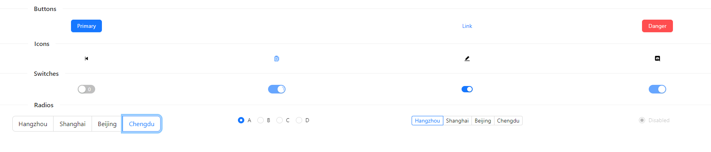

## React Design and Libraries

This lesson is all about using libraries with React. We will talk about other libraries but really were just going to use [ANTD](https://ant.design/). First you need to understand what library is and its purpose. A library is some code that someone else made and posted publically. The most popular place to find this code is at [NMP](https://www.npmjs.com/) or Node Package Manager. You can find a bunch of great things like [confetti](https://www.npmjs.com/package/rn-confetti-cannon) or [ticker](https://www.npmjs.com/package/infobae-react-ticker). The one we want to use today is [here](https://www.npmjs.com/package/antd). Right on the top you we see instructions on how to install it. So, in your terminal type `npm i antd`. Now that you have it installed lets start working with it.

## Task 1
1. create a components folder
2. in components create `MyLayout.tsx`
3. in this file import react
4. create `const MyLayout: React.FC = () => {`
5. create an h1 with hello world as a place holder for now
6. remember to use `export default MyLayout;`
4.  in [app.tsx](./src/App.tsx) import and render MyLayout


<hr>

From here on you will have to look at how the antd people do the examples. I will help get you started but I can't tell you everything.
## Task 2
1. in MyLayout `import { Button, Row, Col, Divider } from 'antd';`
2. return this from your component
```Tsx
<>
<Divider orientation="left">Buttons</Divider>
<Row>
    <Col span={6}>
        <Button type="primary">Primary</Button>
    </Col>
</Row>
</>
```
3. look at the documentation for [Divider](https://ant.design/components/divider), [Row & Col](https://ant.design/components/grid) and [Button](https://ant.design/components/button)
4. make some changes to some props like orientation, span and type
5. make 3 more Col, Buttons in that row but they should all look different

You should have 4 buttons evenly spaced in 1 row. Your final product after task 5 should look like 

## Task 3
1. Create another Divider, Row and Col
2. make a row with 4 evenly spaced [icons](https://ant.design/components/icon)

Make sure you read the docs, icons will require another npm install and another import

## Task 4
1. repeat the process with 4 different [switches](https://ant.design/components/switch)

## Task 5
1. repeat the process with 4 antd components of your choosing
